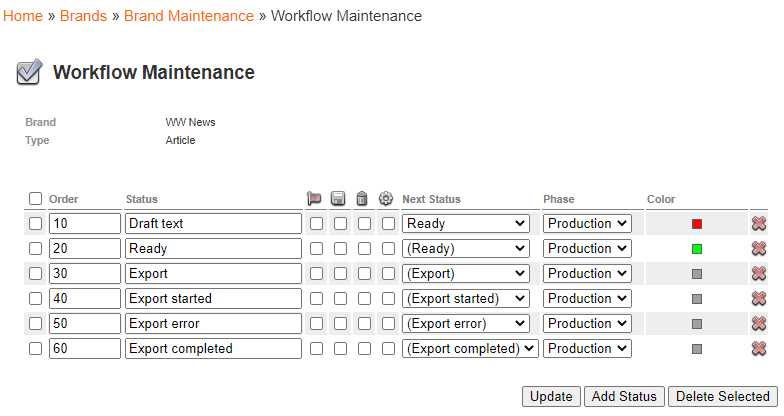

# Hootsuite Transport Channel Setup #

Hootsuite is the most used social media management platform in the world, with over 16 million users.

Our goal it to use its REST API and build our own code within our CDH, that way any client can manage their own social
media albeit a single text message, an image or even a video, with the ability to send the same post so all social
media at once or even schedule them for a later date.

## Installation ##

Guzzle, the recommended way to install Guzzle is with Composer:

    $ composer require guzzlehttp/guzzle:^7.0

Monolog, install the latest version with:

    $ composer require monolog/monolog

FFMpeg binary installed [direct link](https://www.ffmpeg.org/)

## WoodWing Setup ##

At   Home » Brands » Brand Maintenance » Workflow Maintenance » Article, add configuration status if you haven't already,
example:

At Home » Metadata, add a custom property named: PRIMARY_IMAGE and add it to the CDH group, update.

## CDHUI Setup ##

###### Assuming you have a working CDHUI login, created a customer channel, a user with System Role and have CDH configured:

On the channel created, add the following configuration:

    {
    "enterprise": {
        "url": "http://add_your_studioserver_directory",
        "username": "your_username",
        "password": "your_password"
    },
    "notification": {
        "start": {
            "state": "Export started",
            "message_cmd": "C_CDH_NOTIFY_MESSAGE"
        },
        "ok": {
            "state": "Export completed",
            "message_cmd": "C_CDH_NOTIFY_MESSAGE"
        },
        "error": {
            "state": "Export error",
            "message_cmd": "C_CDH_NOTIFY_MESSAGE"
        }
    },
    "version": "1.0"
    }

Add [this](link_to_hootsuite_xml) as a channel export

On the configuration of this channel export, add the following **Pre Process Modules**:

- Collectlayoutimages
- Collectimagesmetadata
- Collectdossiermetadata

Both 3 Pre Process Modules have this configuration:

    {
        "url": "http://add_your_studioserver_directory",
        "username": "your_username",
        "password": "your_password"
    }
- Collectdossierfiles

Add this configuration:

    {
        "url": "http://add_your_studioserver_directory",
        "username": "your_username",
        "password": "your_password",
        "queryparams": [
            {
                "Property": "Type",
                "Operation": "=",
                "Value": "Video"
            }
        ]
    }

Add these **Transport Modules**:

- [file](add.file.here.to.be.downloaded), change the path according to your machine till the FileOut directory, i.e. C:/wamp64/www/sQAuroraCDH/Temp/FileOut/
- [hootsuite](add.file.here.to.be.downloaded) here the hootsuite client is going to be setup.

 
    {
        "client_id": "enter_your_client_id",
        "client_secret": "enter_your_client_secret",
        "member_id": enter_your_member_id,
        "base_uri": "https://platform.hootsuite.com",
        "primary_image_cmd": "C_PRIMARY_IMAGE",
        "ffmpeg": {
            "path": "after_installing_ffmpeg_add_path_to_it's_/bin/ffmpeg.exe",
            "format_video": {
                "FACEBOOKPAGE": "ffmpeg -i [filePath] -s 640x480 [convertedFileName]",
                "LINKEDINCOMPANY": "ffmpeg -i [filePath] -s 400x960 [convertedFileName]",
                "TWITTER": "ffmpeg -i [filePath] -s 1280x720 [convertedFileName]"
            }
        },
        "socialmedia_profiles": {
            "FACEBOOKPAGE": social_media_FACEBOOKPAGE_id,
            "LINKEDINCOMPANY": social_media_LINKEDINCOMPANY_id,
            "TWITTER": social_media_TWITTER_id
        }
    }

## Documentation ##

- [Overview Guide](https://developer.hootsuite.com/docs/api-guides)
- [API Endpoints Guide](https://platform.hootsuite.com/docs/api/index.html#operation/oauth2Token)
- [Download Swagger File](https://platform.hootsuite.com/docs/api/index.html#)

## ContentStation Setup ##

After setting up the above configs, in order to test, follow these steps:

- Add a new Dossier
- Add some images to it
- Add a video if you have one, if not here's a [sample](sample_download_site)
- On InDesign2020, create a new layout
- Add 2 text areas, set them as text elements: head and intro
- Add some Rectangle Frames to place your images
- Place the images you added to your liking
- On WoodWing menu at InDesgin2020: Create an Article From Document
- Save it on your Dossier previously created
- Do a Check of the layout
- In order to select the image to be sent, toggle the PRIMARY_IMAGE on the image you want
- Change status of the article to Extract or your status that will trigger the publishing event
- Check Hootsuite Dashboard or log files if the posts were successfully sent

 At the moment because of API limitations, there can only ge one media file uploaded per post, one video or one image. 

 For the same reasons, post can be sent only to Facebook company page, Linkedin company page and Twitter.
 
If you check the backing folder: sQAuroraCDH\Temp\InceptionExport\backing\
- A copy of the images you selected will appear on directory images
- All the converted videos will appear in separated social media folders